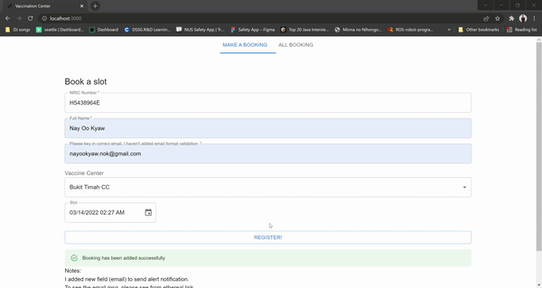

# Author
    Nay Oo Kyaw
    nayookyaw.nok@gmail.com

# Demo project

# Video Demo
https://youtu.be/aQgmiR97JCA

# Prerequirement
1. Install Docker (based on your OS)
2. I installed using below link (for linux because I used Ubuntu)

https://docs.docker.com/engine/install/ubuntu/
https://docs.docker.com/compose/install/

* Details Steps to install docker
1. sudo apt-get update
2. sudo apt-get install \
    ca-certificates \
    curl \
    gnupg \
    lsb-release
3. curl -fsSL https://download.docker.com/linux/ubuntu/gpg | sudo gpg --dearmor -o /usr/share/keyrings/docker-archive-keyring.gpg

4. echo \
  "deb [arch=$(dpkg --print-architecture) signed-by=/usr/share/keyrings/docker-archive-keyring.gpg] https://download.docker.com/linux/ubuntu \
  $(lsb_release -cs) stable" | sudo tee /etc/apt/sources.list.d/docker.list > /dev/null

5. sudo apt-get update
6. sudo apt-get install docker-ce docker-ce-cli containerd.io
7. sudo curl -L "https://github.com/docker/compose/releases/download/1.29.2/docker-compose-$(uname -s)-$(uname -m)" -o /usr/local/bin/docker-compose
8. sudo chmod +x /usr/local/bin/docker-compose
9. docker-compose --version

After you installed docker and docker-compose, you are ready to run the project.

# How To Run with Docker
1. go to project folder and find 'docker-compose.yml'
2. open terminal as same path of docker-compose.yml
3. run the below commands

    $ docker-compose build
    $ docker-compose up

# See project
http://localhost:3000

# Done
Congratulations, you can run successfully!

# Github Link
https://github.com/nayookyaw/react-js-node-js-mongodb